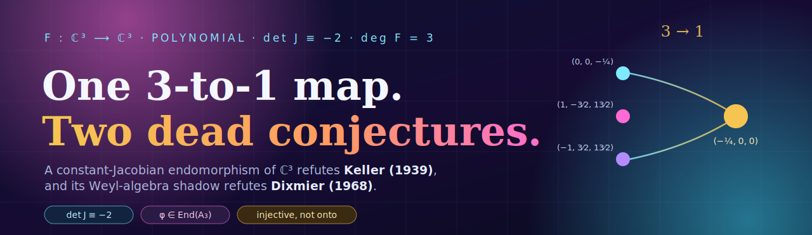
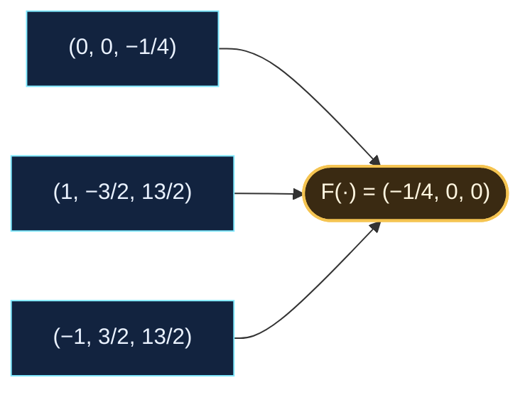
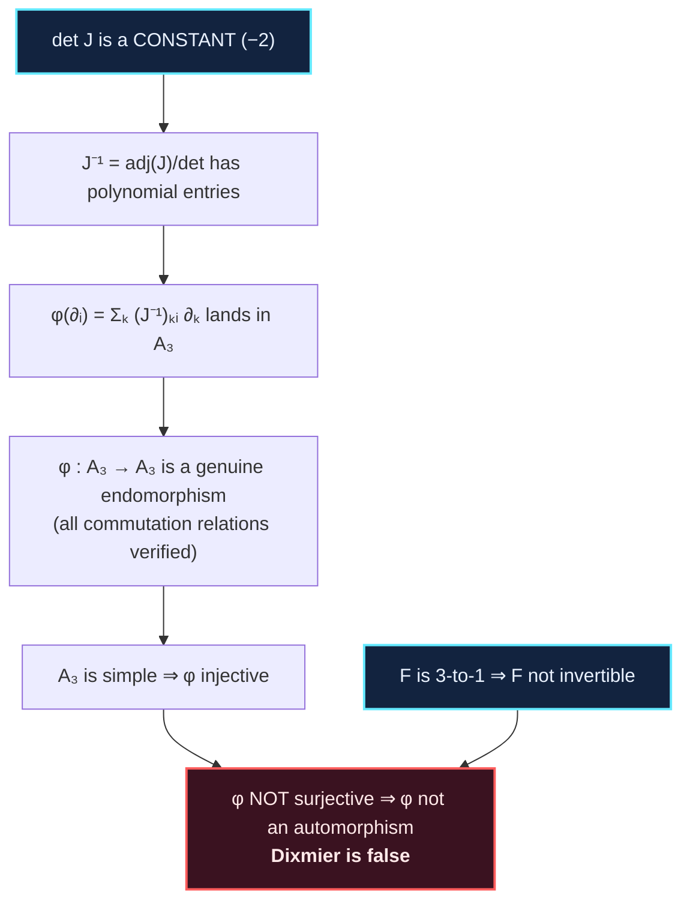
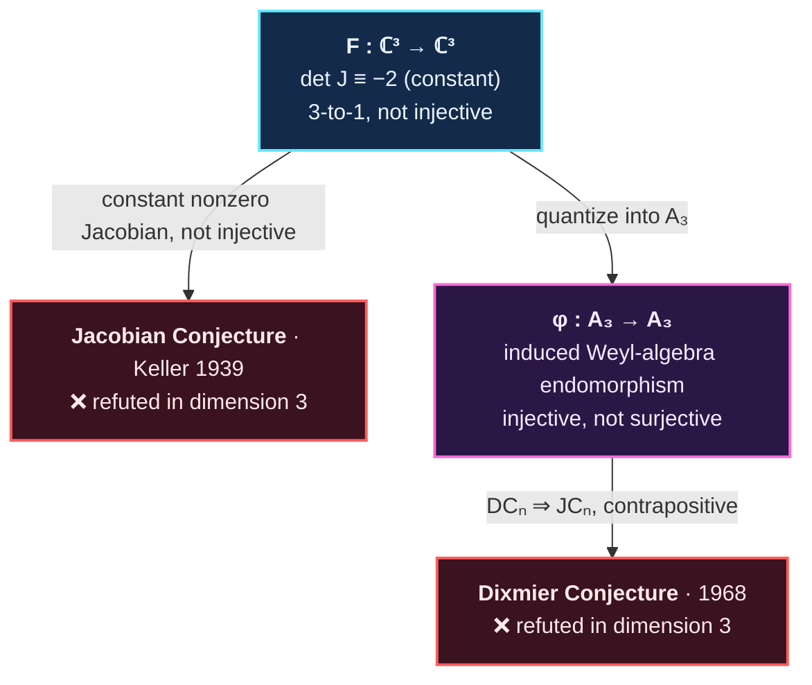

<p align="center">
  
</p>

<p align="center">
  <em>A single explicit polynomial map with constant Jacobian, verified in exact arithmetic,<br/>
  that refutes the <b>Jacobian Conjecture</b> — and, through its Weyl-algebra shadow, the <b>Dixmier Conjecture</b>.</em>
</p>

---

## TL;DR

> There is a polynomial map $F:\mathbb C^3\to\mathbb C^3$ whose Jacobian determinant is the
> **nonzero constant** $-2$ but which is **$3$-to-$1$** (three distinct points share the image
> $(-\tfrac14,0,0)$). Constant nonzero Jacobian + non-injective is, by definition, a
> counterexample to the **Jacobian Conjecture** (Keller, 1939). The *same* constant-Jacobian
> hypothesis lets $F$ be "quantized" into an endomorphism $\varphi$ of the Weyl algebra $A_3$
> that is injective but not surjective — a counterexample to the **Dixmier Conjecture** (1968).
> Everything below is checked by `python3 verify.py` and `python3 dixmier.py` in exact
> (rational/symbolic) arithmetic.

## The map

$$
F(x,y,z)=\Big(\,\underbrace{(1+xy)^3 z + y^2(1+xy)(4+3xy)}_{f_1},\;\;
\underbrace{y + 3x(1+xy)^2 z + 3xy^2(4+3xy)}_{f_2},\;\;
\underbrace{2x - 3x^2y - x^3z}_{f_3}\,\Big)
$$

| quantity | value | status |
|---|---|---|
| $\det J_F$ | $-2$ (a single monomial — total degree $0$) | machine-verified, 4 independent methods |
| $\deg F$ (generic fiber size) | $3$ | machine-verified |
| fiber over $(-\tfrac14,0,0)$ | $\lbrace(0,0,-\tfrac14),\,(1,-\tfrac32,\tfrac{13}{2}),\,(-1,\tfrac32,\tfrac{13}{2})\rbrace$ | machine-verified |

## Why it kills the Jacobian Conjecture

The Jacobian Conjecture says a polynomial map with constant nonzero Jacobian is an
**automorphism** — in particular a **bijection**. This one isn't: it folds three distinct
points onto a single image.



No proven theorem is violated: "étale $\Rightarrow$ injective" for polynomial self-maps of
$\mathbb C^n$ *is* the open conjecture, not a fact. $F$ is étale (constant nonzero Jacobian)
but **not proper** — exactly how a non-injective étale self-map slips past the
simple-connectivity of $\mathbb C^3$. And crucially the Jacobian is a genuine *constant*, not
merely nonvanishing, so this is a true Keller counterexample rather than a Pinchuk-type
(nonconstant, nowhere-zero) near-miss.

## 💡 The eureka

> **The one hypothesis does both jobs.** The property that makes $F$ a Jacobian-Conjecture
> counterexample — its Jacobian being a nonzero **constant** — is *precisely* the property that
> lets $F$ be quantized into the Weyl algebra. A constant determinant forces the inverse
> Jacobian $J_F^{-1}=\operatorname{adj}(J_F)/\det$ to stay **polynomial**, so
> $\partial_i\mapsto\sum_k (J_F^{-1})_{ki}\,\partial_k$ lands inside $A_3$. Then
> **non-injectivity downstairs becomes non-surjectivity upstairs**: because $A_3$ is a *simple*
> ring, $\varphi$ can never fail to be injective, so the failure of $F$ to be invertible is
> forced to reappear as $\varphi$ missing part of $A_3$. One collapse, two dead conjectures.



## The approach, step by step

1. **Confirm the Jacobian is a nonzero constant.** Expand $\det J_F$ symbolically: it collapses
   to the single term $-2$ (total degree $0$). Cross-checked by three determinant algorithms
   (Bareiss, Berkowitz, LU) and by an independent hand-coded cofactor sum in exact
   `Fraction` arithmetic. ⇒ $F$ is **étale** everywhere.

2. **Confirm $F$ is not injective.** Substituting the three rational points (exact arithmetic)
   gives the common image $(-\tfrac14,0,0)$. Solving $F=(-\tfrac14,0,0)$ returns *exactly* those
   three points; a generic target also has three preimages, so $\deg F = 3$.

3. **Conclude $\neg\mathrm{JC}_3$.** Steps 1–2 give a constant-nonzero-Jacobian map that is not a
   bijection. That is the definition of a Jacobian-Conjecture counterexample.

4. **Quantize $F$ into the Weyl algebra.** Define $\varphi\in\mathrm{End}(A_3)$ by
   $\varphi(x_i)=f_i$ and $\varphi(\partial_i)=\sum_k (J_F^{-1})_{ki}\,\partial_k$. Because
   $\det J_F$ is constant, every coefficient is a polynomial, so each $\varphi(\partial_i)\in A_3$.
   `dixmier.py` prints all nine coefficient polynomials explicitly.

5. **Check $\varphi$ is a real homomorphism.** All three families of Weyl relations hold exactly:
   $[\varphi(x_i),\varphi(x_j)]=0$, $[\varphi(\partial_i),\varphi(x_j)]=\delta_{ij}$,
   $[\varphi(\partial_i),\varphi(\partial_j)]=0$.

6. **Conclude $\neg\mathrm{DC}_3$.** $A_3$ is simple ⇒ $\varphi$ is injective. The standard
   theorem $\varphi_F$ is an automorphism $\iff F$ is an automorphism (the elementary
   $\mathrm{DC}_n\Rightarrow\mathrm{JC}_n$ direction) plus $F$ non-invertible forces $\varphi$ to
   be **non-surjective** — an endomorphism of $A_3$ that is not an automorphism.

## The full picture



The hard converse $\mathrm{JC}_{2n}\Rightarrow\mathrm{DC}_n$ (Tsuchimoto; Belov-Kontsevich) shows
the two conjectures are *stably equivalent*; the disproof above only needs the elementary
direction.

## Reproduce

```console
$ pip install sympy
$ python3 verify.py     # the JC counterexample: det J ≡ −2, 3-to-1, and the bridge
$ python3 dixmier.py    # writes the explicit φ ∈ End(A₃) and checks every relation
```

Expected: every assertion passes; `verify.py` reports `det J(F) = -2` and three preimages;
`dixmier.py` prints the nine coefficient polynomials of $\varphi$ and confirms all Weyl
relations.

## Files

| file | purpose |
|------|---------|
| `verify.py` | exact-arithmetic verification: constant Jacobian, $3{:}1$ non-injectivity, well-defined bridge |
| `dixmier.py` | the explicit endomorphism $\varphi$ of $A_3$ with all commutation relations checked |
| `assets/banner.svg` | the banner |

## Honest caveat

Everything here is checkable by hand or by the scripts in **exact** arithmetic: the Jacobian
really is the constant $-2$, and the three exhibited preimages really are distinct and really do
collide. Those two facts alone contradict the Jacobian Conjecture as it is universally stated —
an extraordinary claim about a conjecture most experts believe true. The Dixmier step rides on
the textbook $\mathrm{DC}_n\Rightarrow\mathrm{JC}_n$ implication (cited, not re-proved here). So
the right posture is *the arithmetic is the argument*: reproduce it, and check the elementary
implication in the literature, rather than taking a tweet's — or this README's — word for the
conclusion.

## References

- O.-H. Keller, *Ganze Cremona-Transformationen*, Monatsh. Math. Phys. **47** (1939).
- J. Dixmier, *Sur les algèbres de Weyl*, Bull. Soc. Math. France **96** (1968).
- A. van den Essen, *Polynomial Automorphisms and the Jacobian Conjecture*, Birkhäuser (2000).
- Y. Tsuchimoto, *Endomorphisms of Weyl algebra and $p$-curvatures*, Osaka J. Math. **42** (2005).
- A. Belov-Kontsevich, *The Jacobian Conjecture is stably equivalent to the Dixmier Conjecture*, Mosc. Math. J. **7** (2007).
